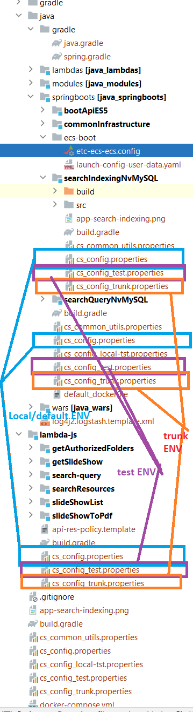
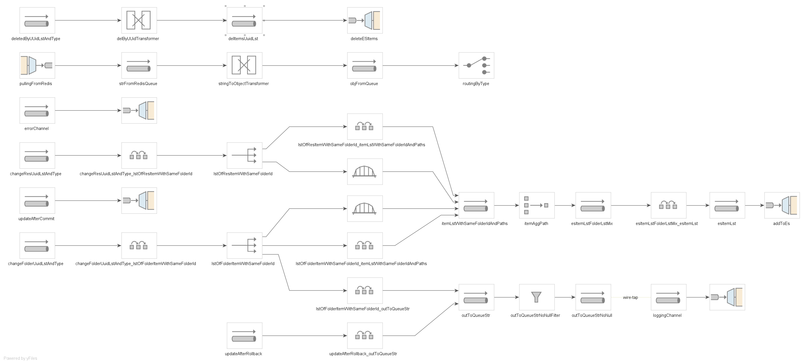

# Various Legacies from 2016: Event driven files processing with Spring Integration 4

### Infrastructure by code:

####Calling AWS API directly with Gradle DSL
####Calling docker cli to build image with Gradle DSL

### Environments on demand by cloning/updating default environment configs
#### Environment serves application.
#### No concept of environment inside an environment.

### java/springboots/seachIndexingNvMySQL:
An Spring Integration implementation for tranforming MySQL tables to Elasticsearch indexing.

